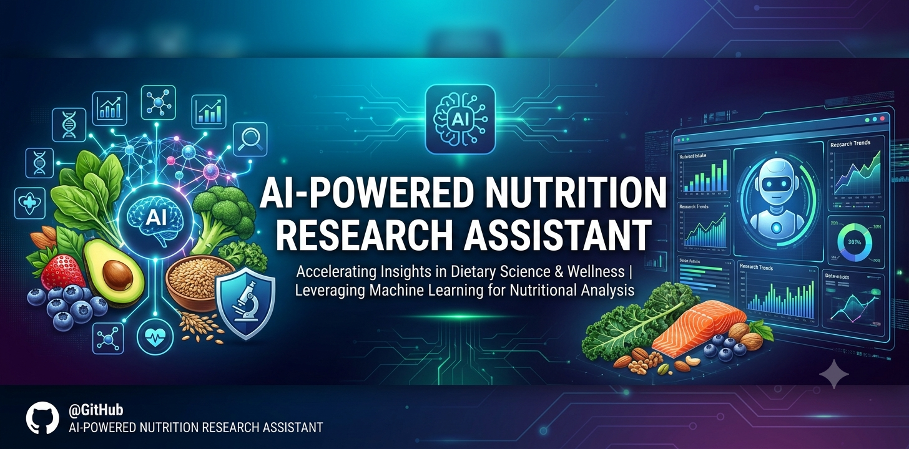
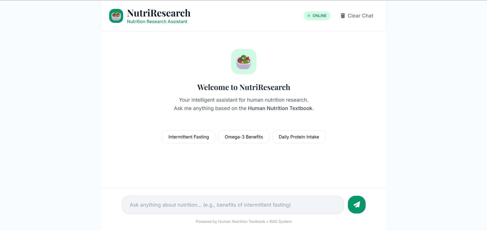
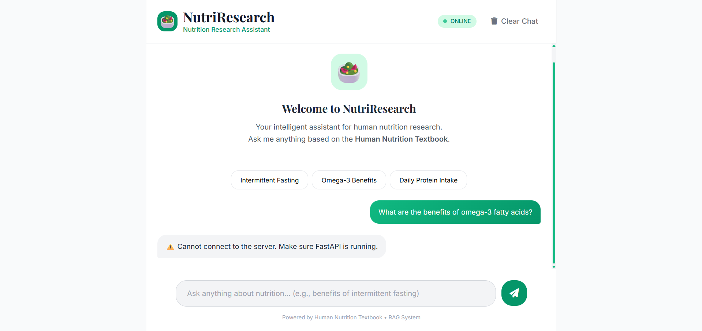
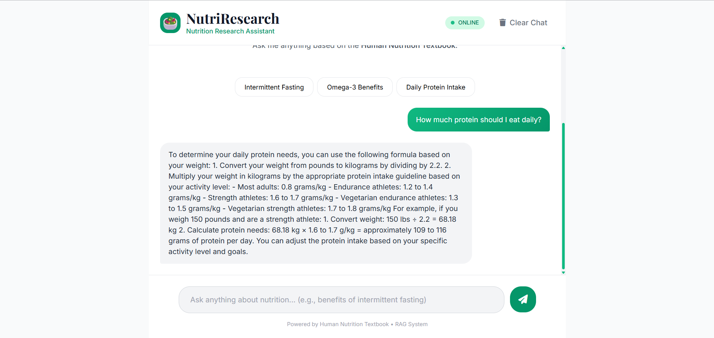

# NutriResearch - Nutrition Research Assistant

## Sample Images



```markdown
A beautiful, responsive AI-powered Nutrition Research Assistant built with **HTML, CSS, JavaScript** and **FastAPI + LangChain + OpenAI**.


---

## ✨ Features

- Modern, clean and user-friendly interface
- Real-time chat experience
- Powered by OpenAI (GPT-4o-mini)
- Fully responsive design
- Easy to deploy
- Example suggestion buttons

---

---
## 🎥 Demo Video

https://github.com/QaziSaim/Nutrition-Research-Assistant/blob/main/nra.mp4 
## 🛠 Project Structure

```
nutrition-assistant/
├── index.html
├── styles.css
├── script.js
├── main.py
├── backend.py
├── requirements.txt
├── vercel.json
├── .env
└── README.md
```

---

## 🚀 Quick Start

### 1. Clone the Repository
```bash
git clone <your-repo-url>
cd nutrition-assistant
```

### 2. Install Dependencies
```bash
pip install -r requirements.txt
```

### 3. Setup Environment Variables
Create a `.env` file in the root directory:
```env
OPENAI_API_KEY=your_openai_api_key_here
```

### 4. Run Locally
```bash
python main.py
```

Open your browser and go to: `http://localhost:8000`

---

## 📁 File Descriptions

| File                | Description |
|---------------------|-----------|
| `index.html`        | Main frontend interface |
| `styles.css`        | Custom styling and Tailwind support |
| `script.js`         | Chat logic and API communication |
| `main.py`           | FastAPI backend server |
| `backend.py`        | ChatOpenAI logic and prompt |
| `vercel.json`       | Configuration for Vercel deployment |

---

## 🌐 Deployment

### Deploy on Vercel

1. Push your code to GitHub
2. Go to [vercel.com](https://vercel.com) and import your repository
3. Set `Framework Preset` to **Other**
4. Add Environment Variable:
   - `OPENAI_API_KEY` → Your OpenAI key
5. Deploy

> **Note**: Vercel works well for this project. For heavy usage, consider Render or Railway for the backend.

---

## 🔧 Technologies Used

- **Frontend**: HTML5, Tailwind CSS, Vanilla JavaScript
- **Backend**: FastAPI, LangChain, OpenAI
- **Deployment**: Vercel

---

## 💡 Example Questions

- What are the benefits of intermittent fasting?
- How much protein should I consume daily?
- What are the best sources of omega-3 fatty acids?
- Explain the importance of gut health

---

## 📝 License

This project is open source and available under the [MIT License](LICENSE).

---

## 🤝 Contributing

Feel free to open issues and pull requests!
